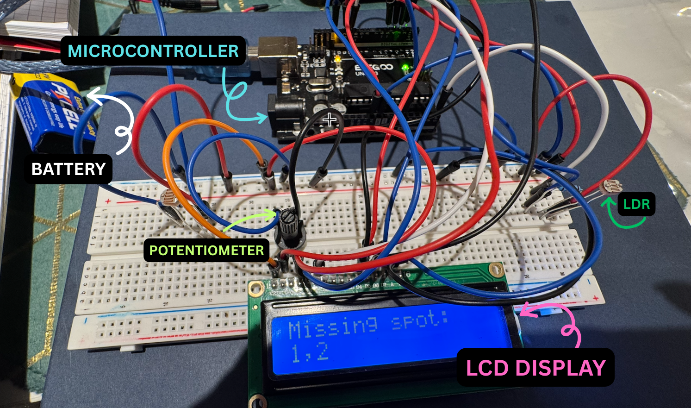

# Clicker Shelf Detection System

Arduino-based embedded system that automatically detects missing classroom clickers using photoresistor sensors and displays real-time status on an LCD.

## Overview
Each slot contains a light sensor.  
Blocked light → clicker present  
Light detected → slot marked missing  

## Features
- Real-time detection
- Analog sensor threshold logic
- LCD1602 live status display
- Portable battery-powered design

## Tech Stack
- Arduino (C++)
- Photoresistors
- Voltage divider circuits
- LCD1602 display

## How It Works
1. Sensors read light levels
2. Arduino compares values to threshold
3. System determines present vs missing
4. Results displayed on LCD

## Files
- `clicker_shelf.ino` – main firmware

## Demo & Hardware
| Live Detection Demo | Circuit Wiring |
|--------------------|---------------|
|  |  |

